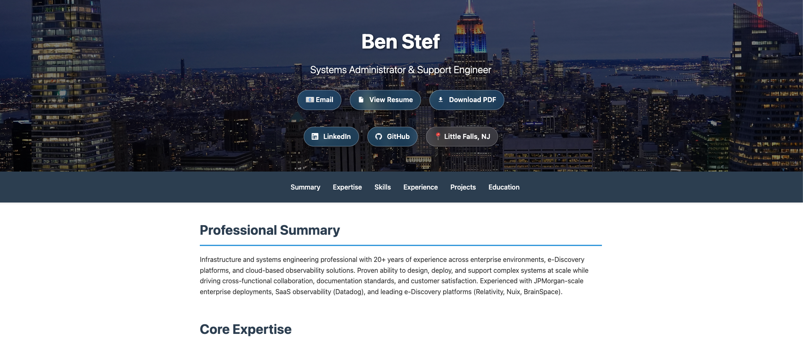

# Ben Stef — Resume & Portfolio Site

Personal resume site for Ben Stef, Senior Infrastructure Engineer. Built with plain HTML and CSS — no frameworks, no build step, deployable anywhere.

🔗 [benstef.com](https://benstef.com)



---

## Features

- Hero banner with NYC skyline background and glassmorphism contact buttons
- GitHub, LinkedIn, Resume PDF, and Website links in the hero
- Projects section spotlighting [ZoomMCP](https://github.com/bstef/zoommcp) — an open-source MCP server for the Zoom API, with links to the repo and [LinkedIn article](https://www.linkedin.com/pulse/i-built-tool-lets-claude-ai-control-your-zoom-so-you-never-ben-stef-yudve/)
- Sticky navigation with smooth scrolling
- Responsive layout (mobile + desktop)
- Circular headshot favicon (16/32/48px ICO + 180px PNG for Apple touch)

## Structure

```
index.html                  # Primary production page
resume.html                 # Expanded resume page (with PDF download button)
resume/                     # Resume PDF
  Ben Stef Resume.pdf
assets/                     # Images and icons
  bobby-stef-tp14k-3OOhg-unsplash.jpg  # Hero background photo
  favicon.ico               # Multi-size favicon (16/32/48px)
  favicon.png               # Apple touch icon (180px)
  website-screenshot.png    # README preview screenshot
archive/                    # Alternate design variants (not in use)
  chatgpt-index.html
  claude-initial.index.html
```

## Sections

| Section | Description |
|---|---|
| Summary | 19+ years in systems administration and infrastructure |
| Core Expertise | e-Discovery, cloud platforms, observability, scripting |
| Experience | JP Morgan Chase · Datadog · Consilio |
| Projects | ZoomMCP — MCP server for the Zoom API |
| Skills | OS, cloud, monitoring, e-Discovery, web technologies |
| Education | BS EE, UIC · CCNA · UIC Engineering EXPO 2007 winner |

## Deployment

Static files — host anywhere:

```bash
# GitHub Pages: push to main, enable Pages in repo settings
# Netlify: drag-and-drop the folder or connect the repo
# S3: aws s3 sync . s3://your-bucket --exclude ".git/*"
```

## Recent Changes

**March 2026**
- Added GitHub profile button to hero header
- Added Projects section with ZoomMCP card (tags, description, GitHub link)
- Added circular headshot favicon generated from profile photo

**February 2026**
- Updated copyright year to 2026
- Refined hero contact buttons (glassmorphism style, hover states)
- Added inline LinkedIn SVG icons in hero and footer
